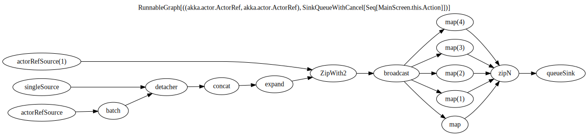

= Travesty
:issueBaseUrl: https://github.com/mikolak-net/travesty/issues/
:toc:

image:https://travis-ci.org/mikolak-net/travesty.svg?branch=master["Build Status", link="https://travis-ci.org/mikolak-net/travesty"]

== What is it?

Travesty is a utility library for Akka Streams. It has two uses:

 - generating structural diagrams of your Akka Streams, both as graphics and text (the latter
 useful for logging). Example:

 - generating https://tinkerpop.apache.org/[Tinkerpop 3 / Gremlin^] graph data structures - usable for e.g. writing tests that check stage sequencing in dynamically constructed Streams.

== How to use it

=== Include in your project

Add to your `build.sbt`

[source,scala]
----
//repo of dependency used for text rendering
resolvers += "indvd00m-github-repo" at "https://raw.githubusercontent.com/indvd00m/maven-repo/master/repository"

"net.mikolak" %% "travesty" % "0.7_AKKAVERSION"
//for example "net.mikolak" %% "travesty" % "0.7_2.5.7"
----

Where `AKKAVERSION` is the version of Akka (Streams) you're using in your project. Currently supported
are versions `2.5.[4-7]`, and Scala `2.12`.

You can review all available versions on link:http://search.maven.org/#search%7Cgav%7C1%7Cg%3A%22net.mikolak%22%20AND%20a%3A%22travesty_2.12%22[Maven Central^].

=== Diagram generation

[source,scala]
----
import net.mikolak.travesty
import net.mikolak.travesty.OutputFormat

val graph = ??? //your graph here

//render as image to file, PNG is supported as well
travesty.toFile(graph, OutputFormat.SVG)("/tmp/stream.svg")

//render as text "image"
log.info(travesty.toString(graph)) //take care NOT to wrap the text
----

==== Adding type labels

This is a non-trivial problem to solve. For more details, see issue {issueBaseUrl}1[#1^].

=== Graph testing

[source,scala]
----
import net.mikolak.travesty
import gremlin.scala._ //traversal operations

val graph = ??? //your graph here

val tested = travesty.toAbstractGraph(graph)

//checks whether the only path through the stream has length two
tested.E().simplePath().toList() must have size 2
----

For more examples, see e.g. link:blob/master/src/test/scala/net/mikolak/travesty/TravestyToGraphSpec.scala[`TravestyToGraphSpec`^].

For general examples of what you can do with Gremlin in Scala, see the appropriately named
https://github.com/mpollmeier/gremlin-scala[gremlin-scala project^].

=== Advanced usage

For further tweaking the rendering, you can use `LowLevelApi`:

[source,scala]
----
val vizGraph = LowLevelApi.toVizGraph(travesty.toAbstractGraph(graph))

//use the instance to change splines, node shapes, etc. etc.

//and finally, use the Java API to render
vizGraph.render(Format.PNG)
----

== How does it work?

Generally, creating a graph of an Akka Stream is *hard*. This is because it's difficult to "get to"
the internals of a Stream and infer its structure. There definitely is no easy solution.

Travesty "cheats" by using https://github.com/akka/akka/blob/master/akka-stream/src/main/scala/akka/stream/impl/TraversalBuilder.scala[the internal `Traversal` API^]. The `Traversal` is a stack-like structure containing instructions on how to construct a running `Stream`.

This stack is parsed and converted into a Gremlin graph, convenient for annotating, pre-processing (e.g. additional decoration of Sources and Sinks), and testing.

The Gremlin graph is converted into a https://graphviz.gitlab.io/[Graphviz^] graph, using https://github.com/nidi3/graphviz-java[graphviz-java^].

Finally, the Graphviz graph is rendered into the required output format.

== Caveats

=== No materialization annotations (for now)

Completely doable, but not present in the current version. Track {issueBaseUrl}2[#2^] to be notified when this gets added.

=== Represents the graph "blueprint", not running stream

The graph/diagram generated from the `Traversal` object does not correspond 1:1 to what will be present in the running Stream. There are at least two reasons for this:

 - the default materializer uses https://doc.akka.io/docs/akka/current/stream/stream-flows-and-basics.html?language=scala#operator-fusion[fusing^] to join stages that can be processed synchronously;
 - there can be other optimizations used by the materializer, such as ignoring stages, adding new stages, etc. Currently, the most prominent are the "virtual" `Sink` stages that can appear in some scenarios.

=== Slooooow

`graphviz-java` provides several implementations of Graphviz to use. However, the one selected as default
by `travesty`, for maximum portability, is also the slowest one. While generating the graph is always fast,
rendering the diagram may take up to ~10 seconds.

=== Tight coupling with Akka Stream's internals

As mentioned before, `travesty` uses the internal API for graph/diagram generation. This is why the
version number follows Akka's versioning scheme.